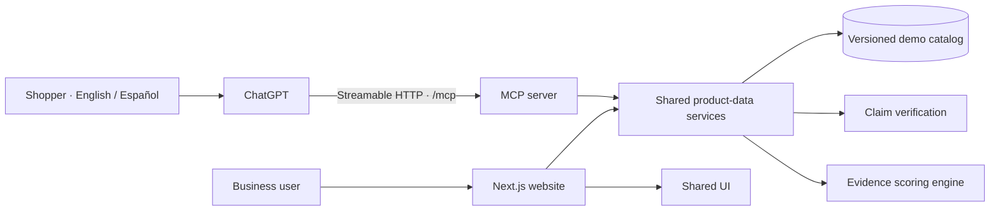

# Confĩa

### AI helps you find it. Confĩa helps you trust it.

**A bilingual product-information trust layer for conversational commerce.**

Built by the UCF team for the **2026 HSI Battle of the Brains**, Confĩa connects a business-facing product dashboard with a ChatGPT-powered discovery experience. Both use the same catalog, evidence records, and verification logic, making it easier to ask not only *“What should I buy?”* but also *“What information supports this answer?”*

**Two applications · One shared catalog · English + Español · Read-only MCP tools**

> **Prototype status:** The local business website and MCP integration are implemented, and the ChatGPT connection has been demonstrated. The current experience uses fictional prices and demo scores. It is a working product demonstration—not a live marketplace, independent certification service, or production merchant platform.

[Quick start](#quick-start) · [Demo walkthrough](#demo-walkthrough) · [Architecture](#architecture) · [Scores and evidence](#scores-and-evidence) · [Limitations](#current-limitations) · [Roadmap](#roadmap)

---

## Why Confĩa exists

As product discovery moves into AI conversations, the information behind a recommendation matters as much as the recommendation itself. A convincing answer can still contain an outdated price, an unsupported specification, or availability that no longer applies.

Businesses need a way to make their product information inspectable. Shoppers need context that helps them distinguish a supported fact from an assumption. Those needs extend across languages and beyond physical goods to software and services.

**Confĩa’s vision is to make product information traceable, explainable, and reusable wherever an AI-assisted buying decision happens.**

| Audience | Value proposition |
| --- | --- |
| Shoppers | Inspect prices, product facts, evidence, and uncertainty in the conversation they already use. |
| Businesses | Understand how their catalog is represented and identify gaps, stale claims, or conflicting information. |
| AI platforms | Retrieve structured product information through a defined tool interface instead of relying only on generated prose. |
| Spanish-speaking users | Access the same underlying records through Spanish descriptions, queries, and interface labels. |

The proposed business advantage is better information quality and transparency. Increased conversion, fewer returns, and stronger customer trust are hypotheses to validate in pilots—not measured outcomes of this demo.

## The product: two halves of one solution

### 1. The conversational experience

ChatGPT is the shopper interface. Confĩa provides a remote **Model Context Protocol (MCP)** server that ChatGPT can call to search products, retrieve details, inspect scores, and compare claims.

A shopper can ask:

> “Use Confia to find video games under $100 and show their demo scores.”

Confĩa returns structured records with explicit prices, currencies, identifiers, category, score basis, and evidence status. ChatGPT presents the answer and handles follow-up questions. There is no separate consumer chat frontend or OpenAI API call in this repository.

### 2. The business platform

The Next.js website presents the value proposition and a public demonstration dashboard for businesses.

| Route | What it demonstrates |
| --- | --- |
| `/` | Product positioning and the Confĩa story. |
| `/dashboard` | Catalog overview, summary metrics, and illustrative activity. |
| `/dashboard/products` | Product names, demo prices, scores, and evidence states. |
| `/dashboard/products/[id]` | Individual product records and supporting claims. |
| `/dashboard/verification` | Evidence status and reasons requiring attention. |
| `/dashboard/discrepancies` | A supplied price compared with an eligible stored observation. |
| `/dashboard/analytics` | A preview of future reporting using illustrative metrics. |

The website includes English and Spanish presentation. Catalog-derived values come from shared services; engagement metrics, trends, and some dashboard activity are demonstration content. Buttons and marketing flows do not imply implemented account management, exports, payments, or lead collection.

## What works today

- **21 searchable records** across power tools, computers, video games, cybersecurity, marketplace services, and financial services.
- **Fictional demo scores for every product**, consistently returned through the product and score tools.
- **Category and keyword search** using IDs, brands, bilingual names, and aliases such as `video games`, `videojuegos`, and `laptops`.
- **Budget and score filters**, explicit USD minor-unit pricing, bounded results, and pagination.
- **Evidence-aware claim comparisons** with match, discrepancy, and unknown outcomes.
- **Four read-only MCP tools** with validated inputs, structured outputs, and error responses.
- **Shared business logic** for the website and MCP server.
- **Local demonstration scripts**, health/readiness endpoints, and a Windows tunnel launcher.
- **Automated domain and MCP integration tests**, TypeScript checks, dependency-boundary checks, and CI.

The catalog contains synthetic products and reference records named after real brands. Brand names and source URLs illustrate the workflow; they do not establish partnerships, endorsements, real offers, or independent verification.

## Scores and evidence

**The displayed demo score and the evidence assessment are different things.** This distinction is deliberate and appears in the tool responses.

| Field | Meaning in the current demo |
| --- | --- |
| `demoScore` | A fictional 0–10 value stored in the product fixture. |
| `trustScore` | The score exposed to clients; currently the fictional demo score for every catalog product. |
| `scoreBasis` | `fictional-demo` identifies a made-up presentation score. |
| `methodologyVersion` | `demo-v1` identifies the demo-score path. |
| `evidenceTrustScore` | The separate evidence-derived prototype result; can be `null` when no applicable assessment exists. |
| `verificationState` | Evidence state: `verified`, `partial`, `conflicting`, `stale`, or `unverified`. |
| `components` | Empty for fictional scores; no calculated explanation is invented for a made-up value. |

A high demo score can appear beside stale or unverified evidence. It does not override that evidence state, certify a product, or imply product quality. Demo scores remain fixed as evidence ages; evidence timestamps and eligibility are still evaluated at request time.

### The evidence-scoring prototype

A separate deterministic `v1` engine exists for the power-tool assessment policy:

| Component | Weight |
| --- | ---: |
| Price evidence | 20% |
| Availability evidence | 20% |
| Specification coverage | 25% |
| Evidence freshness | 20% |
| Supporting evidence | 15% |

The engine evaluates claim eligibility, calculates weighted points, and expresses the result on a 0–10 scale. It is a prototype policy, not an empirically validated certification methodology. Other categories currently receive fictional demo scores without borrowing this power-tool evidence policy.

Price and availability observations have a maximum age of **24 hours**; specification and supporting observations have a maximum age of **30 days**. Evidence must also be within its stored expiry. A conflicting claim remains visible even when other evidence is fresh.

**The model communicates the returned values; it does not calculate or award the score.**

## Architecture



The applications share TypeScript packages rather than calling each other over HTTP. ChatGPT connects to the MCP service; the business website is a separate application with its own deployment.

```text
Confia/
├── apps/
│   ├── web/                  # Next.js landing page and business dashboard
│   └── mcp-server/           # Node.js MCP transport and tool adapters
├── packages/
│   ├── product-data/        # Catalog access, search, demo scores, shared use cases
│   ├── verification/        # Evidence eligibility and claim comparison
│   ├── trust-engine/        # Deterministic evidence-scoring policy
│   ├── types/               # Zod schemas and TypeScript contracts
│   └── ui/                  # Shared React presentation
├── data/demo-products.json  # Catalog, prices, demo scores, claims, and links
├── scripts/                 # Environment setup, fixtures, demo, tunnel lifecycle
├── tests/                   # Domain behavior and MCP integration
├── docs/                    # Setup, contracts, architecture, and product planning
├── .github/workflows/       # CI checks and builds
├── .env.example             # Root configuration guidance
├── .gitignore               # Local configuration, secrets, builds, and logs
├── package-lock.json        # Single npm dependency lockfile
└── turbo.json               # Monorepo task configuration
```

**Stack:** Node.js 24, TypeScript, npm workspaces, Turborepo, Next.js 16, React 19, plain CSS, Zod, the MCP TypeScript SDK, and esbuild. The current runtime uses JSON fixtures; a production database, merchant authentication, and ingestion pipelines are future work.

The catalog is imported into application builds. To keep the two surfaces aligned, build and deploy both from the same commit and catalog revision when shared data changes.

## Quick start

### Prerequisites

- Node.js **24.14.1**, matching `.node-version`.
- npm **11.11.0**, matching `packageManager`.
- A terminal opened at the repository root. VS Code is optional.

```bash
npm ci
npm run setup:env
npm run dev
```

Open the business website at `http://localhost:3000` or the dashboard at `http://localhost:3000/dashboard`.

The MCP service uses port `3001`:

| Endpoint | Purpose |
| --- | --- |
| `http://localhost:3001/health` | Process liveness. |
| `http://localhost:3001/ready` | Catalog and tool readiness. |
| `http://localhost:3001/mcp` | MCP protocol endpoint, not a normal web page. |

### Test the MCP flow without ChatGPT

```bash
npm run demo
```

This runs a local MCP client/server demonstration. It requires neither a public tunnel nor an OpenAI API key. It is useful for verifying tools independently of ChatGPT account access.

### Connect the local demo to ChatGPT

The convenience launcher is Windows-specific and requires `cloudflared.exe` at `.local/bin/cloudflared.exe`. Obtain the binary from Cloudflare's official distribution before using it.

Stop any existing processes occupying ports 3000 and 3001, then run:

```powershell
npm run build
npm run demo:start
```

The script starts the built services and a temporary public tunnel, then prints the **ChatGPT MCP URL**.

1. In the ChatGPT account/workspace that allows custom MCP connections, open the plugin/app creation flow and choose **Create MCP app** where available.
2. Enter the full printed HTTPS URL, including `/mcp`.
3. Select **No authentication** for this public, read-only demo.
4. Create the connection, confirm the four tools, and select Confĩa in a new conversation.

Account availability and interface labels can differ. See the [connection runbook](docs/CHATGPT_SETUP.md) for troubleshooting and further setup notes.

**MCP Inspector is optional.** It tests the endpoint; it does not activate the server, enable its HTTP transport, or connect its products. Users do not need to run Inspector to use Confĩa.

Keep the hosting computer awake and the demo processes running. Other computers can use that same reachable endpoint. Stop managed processes with:

```powershell
npm run demo:stop
```

### A stable URL for ongoing use

Temporary tunnel addresses can change after restart. For ongoing demonstrations, host the MCP service at a stable HTTPS endpoint and keep the same ChatGPT connection across updates.

The **current checkout** binds the Node server to `127.0.0.1`. A managed host generally requires a configurable public bind address such as `0.0.0.0`, the host-provided port, and a configured `CONFIA_PUBLIC_BASE_URL`. Those deployment changes must be made and verified before using such a host. No managed-host deployment manifest is included in this checkout.

Updating a server at the **same URL** does not require another plugin. Redeploy the existing service, refresh its tools when schemas or descriptions change, and test in a new chat. Refreshing tools does **not** discover a replacement tunnel URL. Hosting the website alone does not host the MCP endpoint.

## Demo walkthrough

A short presentation can show the full value proposition in five steps:

| Step | Show or ask | What it proves |
| --- | --- | --- |
| 1. Introduce the business view | Open the landing page, then the product dashboard. | Two experiences backed by one catalog. |
| 2. Search across categories | “Use Confia to find video games under $100 with their demo scores.” | Category search, budget filtering, and structured results. |
| 3. Inspect the record | “Show the evidence and product link for EA SPORTS FC 26.” | Provenance and explicit separation of fictional price/score from evidence. |
| 4. Compare a claim | “Use Confia to verify that drill-001 costs $199.99 USD.” | A discrepancy against $149.99 only while the stored observation is eligible; otherwise an honest unknown. |
| 5. Switch languages | “Usa Confia para buscar videojuegos por menos de 100 dólares.” | Spanish presentation with the same canonical product records. |

For a full catalog tour, ask **“Use Confia to list all products, with a limit of 50.”** The default page size is 20, so the 21-record catalog otherwise spans multiple pages.

Do not explain a fictional score as a calculated evidence result. The demo’s strength is showing the complete information workflow while making uncertainty visible.

## MCP tool reference

| Tool | Purpose |
| --- | --- |
| `search_products` | Search all catalog categories by keywords, category aliases, budget, locale, and minimum score. |
| `get_product` | Retrieve a product’s details, price, demo score, links, claims, and timestamps. |
| `get_trust_score` | Return its score basis, fictional score, separate evidence score, and evidence state. |
| `verify_product_claim` | Compare a supplied price/currency or availability with eligible stored evidence. |

Example search arguments:

```json
{
  "query": "video games",
  "locale": "en",
  "maxPriceMinor": 10000,
  "currency": "USD",
  "minimumTrustScore": 0,
  "includeUnverified": true,
  "limit": 20
}
```

Prices are **integer cents**: `5999` means **$59.99**, and `10000` means **$100.00**. A `null` price means unavailable; it must not be interpreted as free. Current fixtures all have positive demo prices between $24.99 and $899.99. Service descriptions specify the illustrative billing period or package.

`productUrl` and `verificationUrl` are optional HTTPS destinations. `sourceUrl` identifies a claim’s supporting reference when present. Missing links remain `null`; the app should not invent destinations. A product URL is not proof of a claim, and a verification link is not independent certification.

## Environment and repository hygiene

Run `npm run setup:env` to create missing app-local configuration files without overwriting existing ones.

| Variable | Consumer | Purpose |
| --- | --- | --- |
| `NEXT_PUBLIC_APP_URL` | `apps/web/.env.local` | Public website origin; defaults to the local website in the template. Never put a secret in a `NEXT_PUBLIC_` variable. |
| `PORT` | `apps/mcp-server/.env.local` | MCP listening port; local default is `3001`. |
| `CONFIA_PUBLIC_BASE_URL` | MCP server | Allowed public HTTPS origin, without `/mcp`. The demo launcher supplies its tunnel origin to the process. |

Next.js loads the web app’s local environment. The MCP workspace’s development/start scripts load its `.env.local` explicitly. Root environment templates are guidance; root `.env.local` is not the runtime configuration for these apps.

No OpenAI API key is required. ChatGPT runs the conversation and calls the server’s tools.

The `.gitignore` excludes local environment files, credentials, dependencies, build output, caches, logs, and `.local` tunnel state. Sanitized `.env.example` templates and the root lockfile remain tracked.

## Development commands

| Command | Purpose |
| --- | --- |
| `npm run dev` | Start both applications in development mode. |
| `npm run dev:web` / `npm run dev:mcp` | Start either application individually. |
| `npm run check` | Run package-boundary checks, type checks, and automated tests. |
| `npm test` | Run domain and MCP integration tests. |
| `npm run test:mcp` | Run MCP integration tests. |
| `npm run build` | Build both apps and validate shared packages. |
| `npm run start:web` / `npm run start:mcp` | Start the corresponding built application. |
| `npm run demo` | Exercise the local MCP demo programmatically. |
| `npm run demo:start` / `npm run demo:stop` | Start/stop the Windows demonstration services and tunnel. |
| `npm run seed:demo` | Explicitly regenerate the original synthetic fixtures. |

**Fixture maintenance:** Reseeding refreshes timestamps on the original synthetic examples, preserves their configured demo scores, and retains additional catalog records. It does not refresh evidence for those additional records. Other edits to the original generated fixtures should also be reflected in `scripts/seed-demo.mjs` or they can be overwritten. Rebuild/restart apps after catalog changes.

Tests cover score/evidence separation, evidence expiry, claim comparisons, budget filters, English/Spanish parity, pagination, category search, validation, and MCP initialization/tool calls. Passing tests does not guarantee how ChatGPT will phrase an answer; inspect its tool activity and final response during rehearsals.

## Current limitations

| Area | Boundary of this prototype |
| --- | --- |
| Verification | Stored claims and source references are demonstrations, not a live independent verification operation. |
| Scores | Every displayed demo score is fictional. Category-specific, validated scoring policies remain future work. |
| Catalog | A small build-time JSON snapshot; no live retailer inventory, scraping pipeline, product ingestion, or durable catalog editing. |
| Search | Keyword/category matching rather than semantic search; no live web search, exchange-rate conversion, or unit-aware comparison of subscription versus one-time prices. |
| Freshness | Observations expire. Redeploying alone does not refresh evidence or make an unknown comparison valid. |
| Business workflows | Public demo pages, without merchant accounts, tenant isolation, billing, approval workflows, or production exports. |
| Analytics | Illustrative metrics and activity; no measured ChatGPT impressions, attributable sales, or proven ROI. |
| Security and scale | No-auth access is scoped to public demo data. In-memory rate limiting and a single fixture are not production multi-tenant infrastructure. |
| AI presentation | ChatGPT controls prose and layout. Tool schemas and instructions reduce errors but do not guarantee correct wording. |
| Hosting | Local demo/tunnel support exists; durable hosting and production operations require additional configuration. |

A demo score should never be used for a real purchasing, financial, safety, or certification decision.

## Business model and principles

The proposed commercial model is **B2B catalog assessment and monitoring**: businesses pay for onboarding, assessment work, integrations, and ongoing information-quality reporting.

The original hackathon planning scenario assumes **$6,000/month**, **$15,000 one-time onboarding**, and up to **500 priority products**. These are unvalidated planning assumptions—not available subscription plans, implemented billing, or demonstrated willingness to pay.

The intended governance principles are:

- **Payment buys the assessment process, not a favorable result.**
- **Sponsorship is disclosed separately from verification.**
- **Evidence, timestamps, and uncertainty remain inspectable.**
- **AI explains the information; it does not establish truth by assertion.**
- **English and Spanish use the same canonical facts.**

Before commercialization, these principles need enforceable review policies, audit records, appeals, and clear responsibilities for correcting disputed claims.

## Roadmap

| Stage | Priorities | Evidence of success |
| --- | --- | --- |
| **Next: dependable demo** | Stable hosting, complete action labeling, responsive/accessibility review, consistent report links, rehearsal coverage across categories. | Repeatable demonstrations on another computer without recreating connections. |
| **Next: pilot foundation** | Database-backed catalog, merchant identity and access controls, revision history, submission/review workflows, authenticated MCP where needed. | An authorized business can submit and inspect its own records with an audit trail. |
| **Next: credible assessment** | Category-specific claim manifests, source acceptance rules, ingestion adapters, rechecks, conflict handling, and methodology validation. | Scores can be reproduced from accepted evidence and meaningfully evaluated against a benchmark. |
| **Stretch: richer discovery** | Semantic retrieval, additional locales/currencies, service billing units, comparisons, and optional in-chat MCP UI. | Better retrieval without losing provenance or changing the meaning of prices and scores. |
| **Stretch: business intelligence** | Consent-aware event collection, discrepancy trends, freshness alerts, and carefully defined attribution. | Reports distinguish observed activity from inferred outcomes and synthetic examples. |
| **Stretch: ecosystem** | Merchant/feed integrations, additional MCP clients, public distribution, independent review partnerships, and enterprise controls. | Secure interoperability and external validation beyond the original demo. |

Public launch is a separate milestone: it requires security and privacy review, operational monitoring, source/data rights, evaluation of the assessment methodology, and the relevant platform review process.

## Documentation and contribution

| Resource | Use it for |
| --- | --- |
| [ChatGPT setup](docs/CHATGPT_SETUP.md) | Connection workflow, troubleshooting, and demo-score notes. |
| [Architecture](docs/ARCHITECTURE.md) | Package boundaries and the broader technical design. |
| [API contracts](docs/API.md) | Contract design and tool-level context. |
| [Implementation plan](docs/IMPLEMENTATION.md) | Original milestones and delivery goals. |
| [Product vision](docs/PRODUCT_VISION.md) | Positioning and longer-term direction. |

Some supporting documents retain earlier scaffold-era plans. **This README describes the current demo; executable schemas and source code are authoritative for runtime behavior.**

For contributions, keep business logic in shared packages, preserve the synthetic-data labels, update fixtures and their seed source together where applicable, and run `npm run check` plus `npm run build` before proposing changes. Do not add real credentials or private merchant data to the demo catalog.

No license file is currently included. Public repository visibility does not itself grant a software license; confirm reuse terms with the project team.

## Team

Developed by the **UCF team** for the **2026 HSI Battle of the Brains**:

Sebastian Cardenas · Javier Cuevas · Natalia Del Vecchio · Anjanette Diaz · Miguel Hurtado · David Navarrete · Diogo Ortiz · Alejandro Valdez

---

**Confĩa makes the information behind an AI recommendation visible—so the next question can be “What supports that?”**
