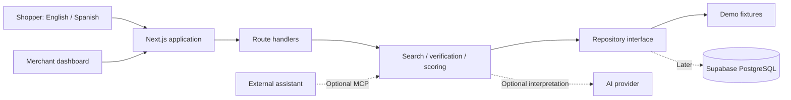

# Confĩa

> **AI helps you find it. Confĩa helps you trust it.**

Confĩa is a bilingual product-information verification platform conceived by the UCF team for the **2026 HSI Battle of the Brains**. It connects shopping discovery with traceable facts, deterministic Trust Scores, and explanations in English and Spanish.

**Status: architecture and planning foundation.** This repository contains documentation and configuration templates. There is no executable application, package manifest, or database migration yet. The features and contracts below describe the implementation target.

## Contents

- [Product scope](#product-scope)
- [Architecture](#architecture)
- [Repository structure](#repository-structure)
- [Getting started](#getting-started)
- [Environment configuration](#environment-configuration)
- [Trust and verification](#trust-and-verification)
- [API and integrations](#api-and-integrations)
- [Development and testing](#development-and-testing)
- [Deployment](#deployment)
- [Demo walkthrough](#demo-walkthrough)
- [Roadmap](#roadmap)
- [Business and governance](#business-and-governance)
- [Team and license](#team-and-license)

## Product scope

AI shopping recommendations can contain incomplete specifications, stale prices, outdated availability, and inconsistent translations. Confĩa lets merchants submit product facts and evidence, assesses individual claims, and exposes the results to shoppers and compatible assistants.

The prototype targets 8–12 clearly labeled synthetic power-tool products. The shopper interface should support search, budget and trust filters, product details, score explanations, discrepancy comparison, and English/Spanish switching. The merchant dashboard should show submitted products, missing evidence, and assessment history.

A Trust Score measures confidence in **product information**, not product quality, safety, or suitability. Unknown information remains unknown. Differences between records are potential discrepancies, not automatic proof of an AI hallucination.

Live payments, retailer scraping, enterprise analytics, and production certification are outside the initial scope. The [original product vision](docs/PRODUCT_VISION.md) preserves the full proposal. Where its illustrative technical examples differ, the architecture below defines the implementation target.

## Architecture

Use a modular Next.js application with shared domain services. Start with a JSON catalog and an explicitly ephemeral merchant demo; add PostgreSQL through a repository adapter. Keep scoring independent of the UI and AI provider.



| Layer | Proposed technology | Responsibility |
| --- | --- | --- |
| Web | Next.js App Router, React, TypeScript | Shopper journey and merchant dashboard |
| UI | Tailwind CSS, shadcn/ui | Accessible controls and reusable components |
| HTTP | Next.js route handlers | Validation, authorization, limits, serialization |
| Domain | Plain TypeScript | Evidence rules, scoring, search, comparison |
| Storage | JSON; later Supabase PostgreSQL | Canonical facts and assessment history |
| AI | Optional server-side adapter | Query interpretation and grounded explanations |
| Integration | Optional MCP adapter | Read-only access to shared services |

Dependency versions must be chosen and locked when the app is scaffolded. See [Architecture](docs/ARCHITECTURE.md) for boundaries, entities, flows, scoring, security, and tradeoffs; see [API contracts](docs/API.md) for payloads and errors.

## Repository structure

Files available now:

```text
Confia/
├── README.md
├── .env.example
├── .env.test.example
├── .gitignore
└── docs/
    ├── ARCHITECTURE.md
    ├── API.md
    └── PRODUCT_VISION.md
```

Target application layout, to be created during implementation:

```text
src/
├── app/
│   ├── page.tsx
│   ├── shop/page.tsx
│   ├── dashboard/page.tsx
│   ├── product/[id]/page.tsx
│   └── api/v1/
├── components/                 # ProductCard, TrustBreakdown, LanguageToggle
├── domain/                     # Types, evidence rules, scoring, comparison
├── services/                   # Search, assessment, merchant workflows
├── repositories/               # Interface, JSON and PostgreSQL adapters
├── integrations/               # Server-only AI and MCP adapters
├── config/                     # Environment validation
└── i18n/                       # English and Spanish messages
 data/demo-products.json
 supabase/migrations/
 tests/                         # Unit, integration, browser acceptance
```

## Getting started

From the repository root, prepare local configuration in PowerShell:

```powershell
Copy-Item .env.example .env.local
Copy-Item .env.test.example .env.test.local
 git check-ignore .env.local .env.test.local
```

For Bash or zsh:

```bash
cp .env.example .env.local
cp .env.test.example .env.test.local
git check-ignore .env.local .env.test.local
```

Both local files should be ignored. Templates contain no working credentials. Demo mode is designed to require no external services.

**Startup is not available yet.** The first implementation milestone must scaffold the application, select an active Node.js LTS release, record it in `.node-version` and `package.json`, and commit an npm lockfile. Add these scripts as part of that milestone:

| Planned command | Intended result |
| --- | --- |
| `npm ci` | Install locked dependencies |
| `npm run dev` | Start development at `http://localhost:3000` |
| `npm run lint` | Check source conventions |
| `npm run typecheck` | Validate TypeScript |
| `npm test` | Run domain and integration tests |
| `npm run test:e2e` | Run browser acceptance scenarios |
| `npm run build` | Build the application |
| `npm start` | Serve the production build |

These commands require a future package manifest and implementation.

## Environment configuration

The templates define a **planned contract**; no runtime currently consumes them. Implement startup validation, parse booleans explicitly, and keep secrets in server-only modules.

| Variable | Default | Purpose |
| --- | --- | --- |
| `NEXT_PUBLIC_APP_URL` | `http://localhost:3000` | Public canonical application URL |
| `CONFIA_DATA_SOURCE` | `demo` | Exactly `demo` or `supabase` |
| `CONFIA_DEMO_WRITES` | `false` | Enable ephemeral demo submissions |
| `CONFIA_DEFAULT_LOCALE` | `en` | `en` or `es` |
| `CONFIA_AI_ENABLED` | `false` | Enable optional AI adapter |
| `OPENAI_API_KEY` | Empty | Server-only; required when AI enabled |
| `OPENAI_MODEL` | Empty | Explicit model identifier; required when AI enabled |
| `SUPABASE_URL` | Empty | Required for Supabase mode |
| `SUPABASE_PUBLISHABLE_KEY` | Empty | Required for session-aware Supabase client |
| `SUPABASE_SERVICE_ROLE_KEY` | Empty | Optional privileged assessment-worker credential |
| `CONFIA_LOG_LEVEL` | `info` | `debug`, `info`, `warn`, or `error` |
| `CONFIA_TEST_NOW` | Test template only | Fixed UTC clock; reject outside tests |

Never use the service-role credential for shopper or merchant requests. Database requests must use the user's session and ownership policies. Scoring weights and freshness windows belong in versioned source, not environment variables.

Store real values in `.env.local`, `.env.test.local`, or the hosting secret manager. The test runner must explicitly load `.env.test.local`. Restart the future app after changing configuration. If startup fails, check the selected mode, nonempty required credentials, boolean parsing, locale, and URL format. If AI is unavailable, use deterministic catalog search and display a fallback notice.

## Trust and verification

The proposed `v1` policy assigns 20 points to price evidence, 20 to availability, 25 to specification coverage, 20 to freshness, and 15 to supporting evidence. Divide the total by ten and round once to one decimal. An unassessed product has `trustScore: null`.

Each result must expose component points, evidence references, methodology version, assessment time, and evaluation time. The [scoring specification](docs/ARCHITECTURE.md#scoring-policy-v1) defines exact formulas, expiry, unknown values, and conflicts. These prototype rules need evaluation before real-world use.

The AI model cannot assign scores or change verified facts. English and Spanish use the same IDs, prices, evidence, and scores; translate presentation text only and visibly fall back when a translation is missing.

## API and integrations

All endpoints are proposed and unimplemented:

| Method | Path | Purpose |
| --- | --- | --- |
| GET | `/health` | Liveness without configuration disclosure |
| POST | `/api/v1/search` | Search with explicit budget, locale, trust filters |
| GET | `/api/v1/products/{id}` | Facts and verification summary |
| GET | `/api/v1/products/{id}/trust-score` | Server-calculated breakdown |
| POST | `/api/v1/verify` | Compare supplied claims with stored observations |
| POST | `/api/v1/merchant/products` | Submit owned information for assessment |

See [API contracts](docs/API.md). Merchant submissions never directly establish verified claims. Assessment creation is a trusted internal workflow.

Optional MCP tools `search_products`, `get_product`, and `get_trust_score` should reuse HTTP service logic. An adapter must be implemented, authenticated, and configured before an external assistant can connect. The standalone demo must work without MCP or an AI key.

## Development and testing

Build a vertical slice first: fixture → repository → score → product page. Keep route handlers thin, domain modules independent of framework imports, and time-sensitive services dependent on an injected clock.

Future implementation PRs should pass lint, type checks, tests, and the production build. Required coverage:

- Score bounds, partial specifications, zero denominators, missing/future/expired evidence, conflicts, exact expiry boundaries, and null assessments.
- Budget/currency constraints, stable pagination, and exclusion of unknown scores from positive minimum-score filters.
- Identical numerical facts across English and Spanish.
- Cross-merchant isolation, unauthorized writes, malformed input, and provider timeouts.
- A complete shopper journey through evidence inspection and price comparison.
- No server secrets in browser bundles, responses, or logs.

Keep synthetic labels in fixtures, UI, API responses, and screenshots. Methodology changes require worked examples and a new version. Do not silently overwrite historical assessments. Add CI after the actual scripts exist.

## Deployment

No deployment configuration exists yet. The intended initial deployment is one Next.js-compatible Node.js service using demo fixtures, AI disabled, and merchant writes disabled. Select a hosting provider during implementation.

Persistent deployments require reviewed database migrations, authenticated merchant ownership policies, separate assessment-worker privileges, and secrets configured through the host. Use demo seeds only in clearly marked demo environments.

Release gates: build and contract tests, bilingual smoke tests, and secret-isolation checks. Record the code revision and scoring version. Use backward-compatible schema migrations and test restore before accepting real merchant records.

Log request IDs, status, latency, provider failures, and assessment versions; omit credentials, raw prompts, and private evidence. Optional AI outages should not disable catalog reads. Evaluate evidence expiry on reads so an unchanged deployment cannot keep presenting expired information as current.

## Demo walkthrough

Once implemented:

1. Load synthetic complete, partial, stale, conflicting, and unassessed products.
2. Search for “a cordless drill under $200.”
3. Apply a minimum score and inspect supporting evidence.
4. Compare a supplied `$199.99` with a stored `$149.99`; show timestamps and a potential-discrepancy label.
5. Switch to Spanish: “Necesito un taladro de menos de $200.”
6. Show the merchant dashboard with missing evidence and pending assessment.

Success means shoppers can trace scores to evidence, understand uncertainty, and see consistent facts in both languages. Merchant submission alone must never generate a verified badge.

## Roadmap

- [x] Architecture, API contracts, environment templates, and preserved product vision.
- [ ] App scaffold, environment validation, lockfile, and CI.
- [ ] Canonical fixtures, schemas, scoring, and comparison tests.
- [ ] Search, product details, explanations, and bilingual UI.
- [ ] Explicitly ephemeral merchant demo workflow.
- [ ] Optional AI interpretation with deterministic fallback.
- [ ] Database migrations, authentication, ownership policies, durable assessments.
- [ ] Optional MCP tools and integration tests.
- [ ] Real evidence sources, recurring verification, monitoring, methodology evaluation.

## Business and governance

The original business proposal assumes **$6,000/month**, a **$15,000 onboarding fee**, and up to **500 priority products**. These are hackathon planning assumptions, not a commercial offer.

Payment funds assessment and monitoring; it cannot buy a higher score. Keep billing and sponsorship out of scoring inputs. Label sponsored placement separately and let shoppers explicitly choose trust filters. Preserve evidence lineage and assessment history so results can be challenged and corrected.

## Team and license

UCF team, 2026 HSI Battle of the Brains:

Sebastian Cardenas · Javier Cuevas · Natalia Del Vecchio · Anjanette Diaz · Miguel Hurtado · David Navarrete · Diogo Ortiz · Alejandro Valdez

No license has been selected or included. Choose one before distributing the project as open-source software.
