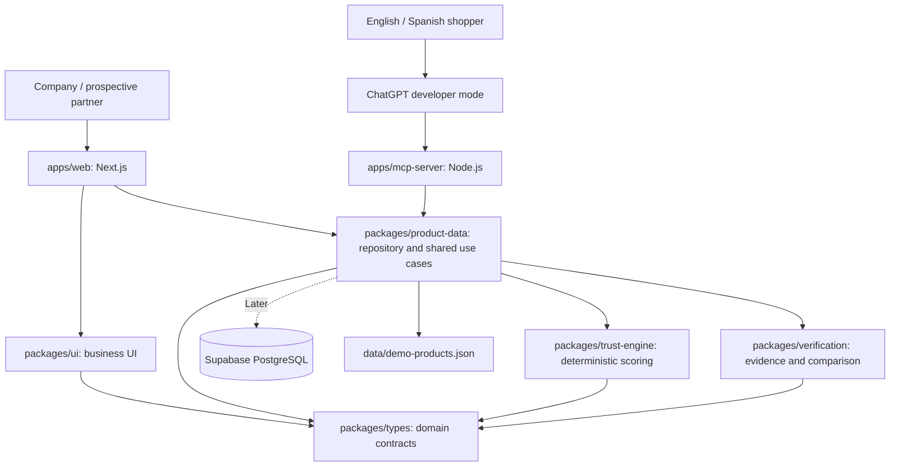
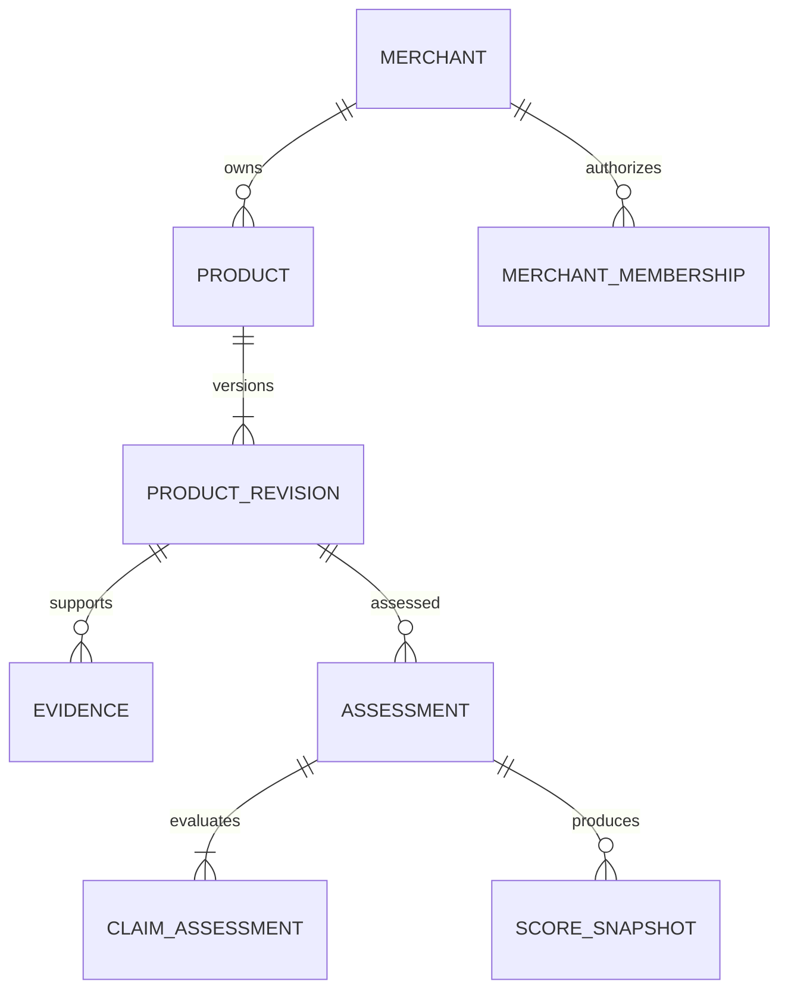

# Confĩa monorepo architecture

The [README](../README.md) is the product scope: **two required applications, one shared verification system**. The business website is a core deliverable, not an optional follow-up. ChatGPT remains the shopper interface.

## Current implementation

The repository contains an npm/Turborepo scaffold, two startable application shells, five shared TypeScript packages, one empty synthetic catalog, boundary checks, a bootstrap integration test, and CI. Scoring metadata and verification vocabulary exist; actual assessment, search, claim comparison, analytics, and MCP tools do not yet. No external ChatGPT connection has been made.

The website's route shells show honest empty states. The MCP process exposes liveness but returns 503 readiness and 501 at `/mcp` until its transport and tools exist. No placeholder tool may return a fabricated verification result.

## System overview



Both apps import public package entry points. Neither calls the other over HTTP to obtain shared business logic. The web browser never imports a repository or privileged credential; Next.js server components/adapters retrieve explicit public DTOs. The MCP dependency tree excludes React and Next.js.

## Workspace map

| Workspace | Responsibility | Allowed internal dependencies |
| --- | --- | --- |
| `@confia/web` | Landing page, dashboard, products, verification, discrepancies, analytics | product-data, types, ui |
| `@confia/mcp-server` | MCP transport, tool validation/results, lifecycle and health | product-data, types |
| `@confia/product-data` | Canonical catalog access, shared search and product/score/comparison use cases | types, trust-engine, verification |
| `@confia/trust-engine` | Versioned scoring, component breakdown, time-based eligibility consumption | types |
| `@confia/verification` | Evidence eligibility, contradictions, claim comparison | types |
| `@confia/types` | Domain types, DTOs, stable enums and eventual runtime schemas | none |
| `@confia/ui` | Reusable React presentation, no data access or business calculations | types |

`product-data` is intentionally the shared application-service facade as well as the repository boundary. Put orchestration there so neither app duplicates it. If complexity warrants a services package later, extract it explicitly; do not quietly add circular imports. Keep trust-engine and verification pure and inject a clock into future use cases.

`npm run check:boundaries` checks declared internal dependencies and source import boundaries. It also rejects UI dependencies in server/domain workspaces. Source reviews must still catch semantic duplication and accidental client-side data access.

## Build and development design

- npm workspaces and one root package-lock.json are the dependency source of truth. Node is pinned in `.node-version`; npm is declared in packageManager.
- Turborepo schedules build/typecheck by declared package dependencies. Shared packages export TypeScript source; their build task validates types without emitting artifacts.
- Next.js transpiles shared packages. The MCP esbuild build bundles internal packages and imported fixtures into its Node ESM output. Shared code is never executed as uncompiled TypeScript in production.
- Root `data/**` and the base TypeScript config invalidate cached tasks. App environment files are build inputs; public metadata environment values are included in the build hash.
- Web dev/start uses port 3000. MCP defaults to 3001 and can use PORT. `npm run dev` starts both; filtered commands start each independently.
- Each app loads its own .env.local. Root .env files from the previous single-service design are legacy and are not loaded. `npm run setup:env` preserves existing app files.
- There is no separate OpenAI API call: ChatGPT handles conversation. Database/auth credentials arrive only with their implementation milestone.

Internal package source compilation follows [Next.js transpilePackages](https://nextjs.org/docs/app/api-reference/config/next-config-js/transpilePackages). Task ordering follows [Turborepo package graphs](https://turborepo.dev/docs/core-concepts/package-and-task-graph).

## Application 1: MCP shopping integration

The target public interface remains four read-only tools: `search_products`, `get_product`, `get_trust_score`, and `verify_product_claim`. See [API contracts](API.md).

The adapter validates model arguments and calls product-data's shared use cases. ChatGPT owns query interpretation and conversational language; Confĩa owns constraints, canonical facts, evidence, score calculation, and result/error schemas. Tool text cannot determine verification status or override formulas.

The implemented process is currently only a bootstrap. Next work is SDK-managed Streamable HTTP at `/mcp`, initialization, discovery, schemas, structured/text results, and MCP integration tests. Avoid exposing fake working tools just to complete discovery. Keep request cancellation and transport lifecycle local to each request.

For remote ChatGPT use, deploy/tunnel this application separately from the business website. The connection URL points to the MCP host, not the web origin. A website deployment does not automatically deploy or connect the MCP service. Follow [ChatGPT setup](CHATGPT_SETUP.md).

## Application 2: business platform

| Route | Current state | Required end state |
| --- | --- | --- |
| `/` | Starter landing page | Bilingual value proposition, process, trust explanation, intentional demo-request behavior |
| `/dashboard` | Shared catalog summary, empty states | Real aggregates from the synthetic catalog and assessment output |
| `/dashboard/products` | Route shell | Product list, verification state, score, filters, detail navigation |
| `/dashboard/products/[id]` | Planned | Canonical product detail, claims, evidence, timestamped breakdown |
| `/dashboard/verification` | Route shell | Evidence coverage, fresh/stale/conflicting states, explainable scoring |
| `/dashboard/discrepancies` | Route shell | Clearly labeled supplied-vs-observed demo comparisons |
| `/dashboard/analytics` | Route shell | Explicitly synthetic impressions, CTR, and language-share examples |

Use server components and a server-only data facade in `apps/web/src/lib/` for reads. Browser controls should consume bounded serialized DTOs, not raw fixtures or evidence stores. Introduce route handlers only when interactive features need them; do not create a duplicate REST API for every MCP tool.

The prototype dashboard is public demo content, not a secure merchant account. Do not accept real company secrets, sensitive uploads, or durable mutations until ownership/authentication exists. A future form creates a pending submission; it never grants verification. No fake successful “Request a Demo” submission: connect a real destination or clearly label the interaction as a demonstration.

## Shared data and cross-app consistency

`data/demo-products.json` is the single product fixture source. It is currently an explicitly empty scaffold. `product-data` imports it at build time, so both builds must use the same repository/catalog revision. No app-owned product copies. Both apps must expose the catalog and methodology revision once real data is implemented.

Publish changes by validating fixtures and rebuilding/deploying both apps from the same commit. A deployment mismatch is detectable by catalogRevision; do not interpret differing revisions as a scoring bug. A future shared database replaces the fixture adapter without changing use-case contracts. Never rely on in-memory writes to synchronize two independent processes.

Required examples: highly verified, mostly verified, partial, stale, unassessed, and deliberate discrepancies, totaling 8–12 products. Evidence dates must be real fixture values; the server clock must not be frozen or reset to keep scores fresh. Use injected clocks only in tests. A rehearsal fixture can be explicitly regenerated and reviewed as synthetic data.

Dashboard product counts, average scores (excluding null), and discrepancy counts should be derived from the same use cases the MCP adapter invokes. Marketing/engagement metrics live in a separately labeled web-owned demonstration fixture. MCP call counts are not equivalent to ChatGPT impressions, clicks, sales, or conversions. Real analytics instrumentation and attribution are future work.

## Domain model


Use UUIDs for durable identifiers, integer minor units for money, ISO currency codes, explicit units for numerical specifications, and UTC timestamps. Demo IDs may be readable strings. A product revision is immutable once assessed.

| Entity | Key fields and constraints |
| --- | --- |
| Merchant | `id`, display name; identity membership is separate |
| MerchantMembership | `userId`, `merchantId`, role; unique pair |
| Product | `id`, `merchantId`, `sku`, active revision; unique merchant/SKU |
| ProductRevision | `id`, `productId`, revision number, localized name/description, category, priceMinor, currency, availability, specifications, submittedAt, synthetic flag |
| Evidence | `id`, revisionId, claimKey, observed value/unit/currency, source URL/label, sourceKind, observedAt, collectedAt, expiresAt, content digest, visibility |
| Assessment | `id`, revisionId, methodologyVersion, assessedAt, assessor, status, required claim manifest |
| ClaimAssessment | assessmentId, claimKey, status, evidence IDs, reason; unique claim per assessment |
| ScoreSnapshot | assessmentId, evaluatedAt, score, component points, expiresAt; append-only |
| AuditEvent | actor, action, entityId, timestamp, requestId; no raw secrets |

Claim statuses are `verified`, `conflicting`, `missing`, and `unsupported`. Runtime eligibility can additionally report `stale`. Product availability is `InStock`, `OutOfStock`, or `Unknown`.

A merchant submits facts; an assessor evaluates evidence. A source marked `merchant` must stay labeled as merchant-provided. Source provenance is not proof of independence. Synthetic assessments must always identify themselves as demo results.

Required specifications and supporting claims come from a versioned category policy, frozen into the assessment. Merchants cannot increase their score by removing a failing claim from the denominator. For the power-tool demo, the supporting manifest includes warranty and return-policy evidence; reviews are deferred until an assessment method exists.



PostgreSQL foreign keys enforce these relationships. Index products by merchant/SKU, revisions by product/version, evidence by revision/claim, and assessments by revision/time. Publish a revision and completed assessment atomically. Retain historical records; corrections create new revisions or assessments.


## Scoring policy v1


This is a proposed prototype policy, not an empirically validated certification methodology. Use an injected UTC clock. Reject negative money, invalid dates, future observation dates, unknown policy versions, and verified counts greater than required counts.

An eligible claim has a completed `verified` decision, evidence attached to the same revision, and at least one accepted source observation satisfying `observedAt <= now < expiresAt`. An unresolved contradiction makes the claim ineligible even if another observation supports it. Missing or unsupported claims earn no points.

Maximum age is 24 hours for price/availability and 30 days for specifications/supporting policy evidence. Set expiry to the earlier of source expiry and observation time plus that maximum. These windows are versioned prototype choices. Exactly at expiry the evidence is stale. Assessment timestamps do not reset observation freshness.

Let `P` and `A` be 1 for eligible price and availability, otherwise 0. Let `S` be eligible required specifications divided by required specifications; let `E` be eligible required supporting claims divided by required supporting claims. A zero denominator contributes 0, never NaN or full credit.

Let `F` be the fraction of all required claims (price, availability, required specifications, supporting claims) that have an accepted, unexpired observation, even if the claim decision is conflicting. Freshness describes recency, while the other components describe agreement and coverage. Missing observations count as 0.

```text
pricePoints         = 20 * P
availabilityPoints  = 20 * A
specificationPoints = 25 * S
freshnessPoints     = 20 * F
supportPoints       = 15 * E
trustScore          = round((sum of component points) / 10, 1)
```

Do not round intermediate components. Example: price and availability eligible, four of five specifications eligible, both supporting claims eligible, and all nine required claims have fresh accepted observations. Points are `20 + 20 + 20 + 20 + 15 = 95`; score is **9.5**. The fifth specification can be conflicting, explaining why freshness is complete while verification coverage is partial.

No completed assessment means `trustScore: null` with state `unverified`. A completed assessment with no eligible evidence may legitimately score 0.0. Proposed display states:

- `verified`: all required claims eligible.
- `partial`: some required claims ineligible, with no unresolved conflict or expired required observations.
- `conflicting`: at least one required claim has an unresolved contradiction; takes precedence over stale.
- `stale`: at least one required accepted observation expired and no conflict takes precedence.
- `unverified`: no completed assessment for the active revision.

A high score does not override a conflict label. Show reasons in addition to the summary state. Current scores are evaluated on reads; historical snapshots retain their original evaluation time. Return the next future evidence expiry as `validUntil`, or null if no future expiry exists. Disable shared response caching in the initial implementation; later cache only until the earliest expiry and invalidate on revision/assessment changes.


## Locale and presentation

Keep canonical IDs, money, units, evidence, scores, and timestamps identical across English and Spanish. Shared types carry localized fields and stable reason codes; presentation translates labels. Return a visible fallback when a translation is missing. The current web shell is English only; bilingual UI and tool fixtures are work items, not completed capabilities.

Neither a UI component nor ChatGPT may calculate a competing score. When implementing, evaluate both surfaces with the same catalog, policy, and clock in a parity test. Check the actual ChatGPT final answer as well as the deterministic tool payload.

## Security and deployment boundaries

Both prototype applications may expose only reviewed public synthetic information. No-auth MCP is acceptable only within that scope. Real merchant data requires authenticated membership and per-record authorization; privileged database credentials must never enter public web variables, bundles, tool output, or logs.

Deploy web to a Next.js-compatible host with access to the monorepo root during build. Deploy MCP to a Node-compatible host and package its built output. Validate streaming/proxy behavior when MCP is implemented. Each application has independent start/health behavior, secrets, logs, and rollback; shared catalog/policy revisions must remain aligned.

The current MCP `/health` proves the process is alive; `/ready` intentionally remains 503. The web build succeeding does not prove ChatGPT connectivity. Log request IDs and versions when implementing tools; avoid raw prompts and private evidence. Future external evidence fetching needs explicit source restrictions and SSRF controls.

## Implementation ownership and delivery gates

[IMPLEMENTATION.md](IMPLEMENTATION.md) maps every README deliverable to an owning app/package, dependencies, and acceptance criteria. Complete domain foundations before wiring product claims into either adapter, then develop the web and MCP halves independently against the same use-case contracts.

The MVP is complete only when both the business experience and the ChatGPT journey pass their acceptance checks. A working MCP demo alone no longer satisfies the README.
