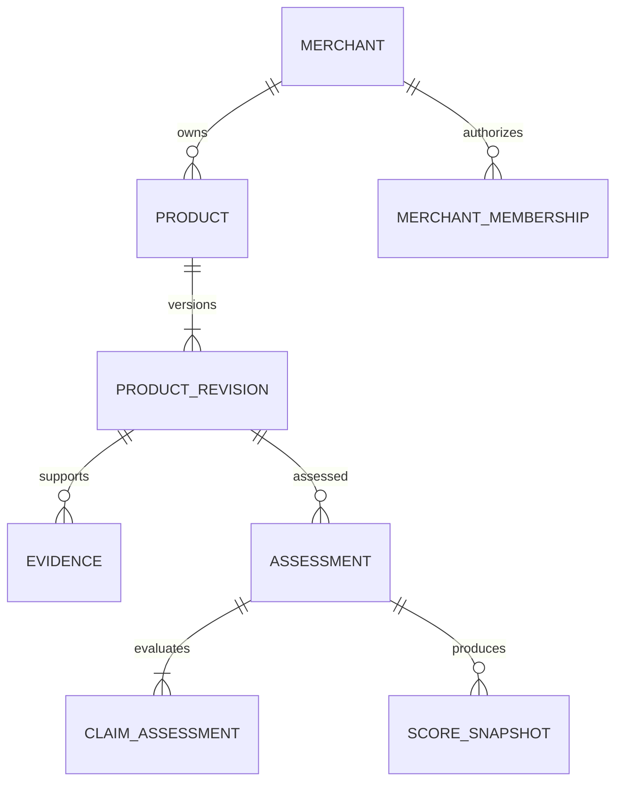

# Architecture specification

Status: proposed implementation blueprint. No components described here are executable yet. This document takes precedence over illustrative technical examples in the preserved product vision.

## Design decisions

1. **Modular monolith:** one Next.js deployment keeps the hackathon manageable. Domain services can later move to workers without changing their contracts.
2. **Repository boundary:** start with validated JSON fixtures; introduce PostgreSQL without changing scoring or presentation code.
3. **Deterministic evidence policy:** versioned rules and an injected clock produce reproducible results. AI cannot write verification results.
4. **Canonical bilingual data:** English and Spanish share facts; localized text is a presentation concern.
5. **Optional integrations:** catalog search, scoring, and comparison continue to work without AI or MCP.

## Boundaries and dependencies

`UI → HTTP adapter → application service → domain + repository interface`

Repository implementations and provider adapters depend on interfaces, never the reverse. Server-only adapters own credentials. UI receives explicit public DTOs, never raw database rows or environment objects. Shared types are validated at runtime at input boundaries.

| Module | Owns | Must not own |
| --- | --- | --- |
| Catalog | Canonical product facts and revision IDs | Verification outcomes |
| Evidence | Source observations, provenance, assessment decisions | Sponsorship or ranking |
| Scoring | Versioned weights, eligibility, breakdown | LLM calls or database writes |
| Discovery | Text/category matching, explicit filters, pagination | Payment-based boosts |
| Comparison | Field-by-field claimed/observed differences | Automatic assessment creation |
| Merchant | Ownership, submissions, pending revisions | Self-issued verification |
| AI adapter | Structured query interpretation, optional explanations | Score calculation or fact mutation |
| MCP adapter | Tool schemas and authenticated service calls | Duplicate business logic |

## Domain model

Use UUIDs for durable identifiers, integer minor units for money, ISO currency codes, explicit units for numerical specifications, and UTC timestamps. Demo IDs may be readable strings. A product revision is immutable once assessed.

| Entity | Key fields and constraints |
| --- | --- |
| Merchant | `id`, display name; identity membership is separate |
| MerchantMembership | `userId`, `merchantId`, role; unique pair |
| Product | `id`, `merchantId`, `sku`, active revision; unique merchant/SKU |
| ProductRevision | `id`, `productId`, revision number, localized name/description, category, priceMinor, currency, availability, specifications, submittedAt, synthetic flag |
| Evidence | `id`, revisionId, claimKey, observed value/unit/currency, source URL/label, sourceKind, observedAt, collectedAt, expiresAt, content digest, visibility |
| Assessment | `id`, revisionId, methodologyVersion, assessedAt, assessor, status, required claim manifest |
| ClaimAssessment | assessmentId, claimKey, status, evidence IDs, reason; unique claim per assessment |
| ScoreSnapshot | assessmentId, evaluatedAt, score, component points, expiresAt; append-only |
| AuditEvent | actor, action, entityId, timestamp, requestId; no raw secrets |

Claim statuses are `verified`, `conflicting`, `missing`, and `unsupported`. Runtime eligibility can additionally report `stale`. Product availability is `InStock`, `OutOfStock`, or `Unknown`.

A merchant submits facts; an assessor evaluates evidence. A source marked `merchant` must stay labeled as merchant-provided. Source provenance is not proof of independence. Synthetic assessments must always identify themselves as demo results.

Required specifications and supporting claims come from a versioned category policy, frozen into the assessment. Merchants cannot increase their score by removing a failing claim from the denominator. For the power-tool demo, the supporting manifest includes warranty and return-policy evidence; reviews are deferred until an assessment method exists.



PostgreSQL foreign keys enforce these relationships. Index products by merchant/SKU, revisions by product/version, evidence by revision/claim, and assessments by revision/time. Publish a revision and completed assessment atomically. Retain historical records; corrections create new revisions or assessments.

## Main flows

### Shopper search

1. Validate locale, query length, pagination, money, and trust filter.
2. Optionally interpret free text into a validated query object. Explicit request filters override inferred fields.
3. Retrieve candidates through the catalog repository.
4. Evaluate the latest completed assessment for each active revision at a single injected `now`.
5. Apply budget/currency and trust constraints, then order by lexical relevance and product ID as a stable tie-breaker. Sponsorship has no input.
6. Return public facts, provenance summaries, and score breakdowns.

Without AI, search uses localized name/category/keywords and explicit budget controls. It need not understand every conversational constraint; show the applied filters so the shopper can correct them. Never silently convert currencies.

### Merchant submission and assessment

1. Authenticate a merchant member and derive merchant identity from their session.
2. Validate ownership, facts, evidence metadata, and an idempotency key.
3. Create a pending revision. Its score is null until a completed assessment exists.
4. A trusted assessor evaluates approved evidence against the frozen category manifest.
5. Commit claim decisions and assessment metadata atomically; calculate a snapshot.
6. Publish the assessed revision and retain the prior version for audit.

In demo mode, writes require `CONFIA_DEMO_WRITES=true`, operate in memory, and reset on restart. They must display that limitation. Public hosted demos keep writes disabled. Durable deployments require authenticated sessions and ownership checks; a demo flag is not authentication.

### Claim comparison

Compare requested supported fields against eligible observations for the active assessed revision. Return `match`, `discrepancy`, or `unknown` per field. Missing, expired, conflicting, or incompatible currency/unit evidence gives `unknown` with a reason. Comparisons do not mutate the product or assessment.

### Recurring verification

Later, a worker selects expired evidence, obtains new observations from approved sources, and creates a new assessment. Use idempotency, bounded retries, and a failed-job queue. Expiry is enforced during reads even if that worker is unavailable. Schedule refresh ahead of the earliest expiry; never treat a failed refresh as successful verification.

## Scoring policy v1

This is a proposed prototype policy, not an empirically validated certification methodology. Use an injected UTC clock. Reject negative money, invalid dates, future observation dates, unknown policy versions, and verified counts greater than required counts.

An eligible claim has a completed `verified` decision, evidence attached to the same revision, and at least one accepted source observation satisfying `observedAt <= now < expiresAt`. An unresolved contradiction makes the claim ineligible even if another observation supports it. Missing or unsupported claims earn no points.

Maximum age is 24 hours for price/availability and 30 days for specifications/supporting policy evidence. Set expiry to the earlier of source expiry and observation time plus that maximum. These windows are versioned prototype choices. Exactly at expiry the evidence is stale. Assessment timestamps do not reset observation freshness.

Let `P` and `A` be 1 for eligible price and availability, otherwise 0. Let `S` be eligible required specifications divided by required specifications; let `E` be eligible required supporting claims divided by required supporting claims. A zero denominator contributes 0, never NaN or full credit.

Let `F` be the fraction of all required claims (price, availability, required specifications, supporting claims) that have an accepted, unexpired observation, even if the claim decision is conflicting. Freshness describes recency, while the other components describe agreement and coverage. Missing observations count as 0.

```text
pricePoints         = 20 * P
availabilityPoints  = 20 * A
specificationPoints = 25 * S
freshnessPoints     = 20 * F
supportPoints       = 15 * E
trustScore          = round((sum of component points) / 10, 1)
```

Do not round intermediate components. Example: price and availability eligible, four of five specifications eligible, both supporting claims eligible, and all nine required claims have fresh accepted observations. Points are `20 + 20 + 20 + 20 + 15 = 95`; score is **9.5**. The fifth specification can be conflicting, explaining why freshness is complete while verification coverage is partial.

No completed assessment means `trustScore: null` with state `unverified`. A completed assessment with no eligible evidence may legitimately score 0.0. Proposed display states:

- `verified`: all required claims eligible.
- `partial`: some required claims ineligible, with no unresolved conflict or expired required observations.
- `conflicting`: at least one required claim has an unresolved contradiction; takes precedence over stale.
- `stale`: at least one required accepted observation expired and no conflict takes precedence.
- `unverified`: no completed assessment for the active revision.

A high score does not override a conflict label. Show reasons in addition to the summary state. Current scores are evaluated on reads; historical snapshots retain their original evaluation time. Return the next future evidence expiry as `validUntil`, or null if no future expiry exists. Disable shared response caching in the initial implementation; later cache only until the earliest expiry and invalidate on revision/assessment changes.

## Bilingual and AI behavior

Canonical facts never pass through free-form translation. Format prices with their stored currency and locale; do not convert amounts or infer missing units. Missing Spanish text falls back visibly to English. Evidence source text keeps its original language.

Treat queries, evidence text, and retrieved content as untrusted data. The optional AI adapter returns a schema-validated interpretation; discard invalid fields and use deterministic fallback on timeout or failure. Any explanation must cite returned evidence IDs. The UI always renders scores and factual values directly from service output. No AI write tools are exposed.

## Security and operational boundaries

- Use session authentication, merchant membership authorization, and database row-level policies for durable writes. Derive ownership server-side.
- Protect cookie-authenticated mutations with same-origin and CSRF controls. Default CORS to same origin.
- Assessment workers use separate privileged credentials; normal requests never bypass row-level policies.
- Enforce request size, rate limits, pagination limits, and AI timeouts. Escape merchant text before rendering.
- Initially accept source URLs as metadata only. A future evidence fetcher needs HTTPS allowlists, private-address blocking, redirect validation, size/time limits, and restricted egress.
- Expose only public evidence summaries. Private uploads and raw evidence require authenticated access and retention rules before implementation.
- Emit request IDs and structured metrics without secrets or raw personal data. Track expired evidence, assessment failures, AI fallback, and error rates.
- Keep a backup/restore plan and migration rollback strategy before storing real submissions.

## Delivery milestones and acceptance

1. Scaffold: locked dependencies, validated environment, lint/type/build checks.
2. Domain: validated fixtures, deterministic scoring, expiry and conflict tests.
3. Shopper: search and evidence explanations with bilingual parity and accessible controls.
4. Merchant demo: pending submissions, explicit reset behavior, no self-verification.
5. Persistence: migrations, isolation tests, assessment audit history, restore exercise.
6. Integrations: optional AI fallback and authenticated read-only MCP with contract tests.

Choose infrastructure and performance targets from actual prototype measurements. Avoid inventing availability or certification guarantees before deployment and evaluation.
