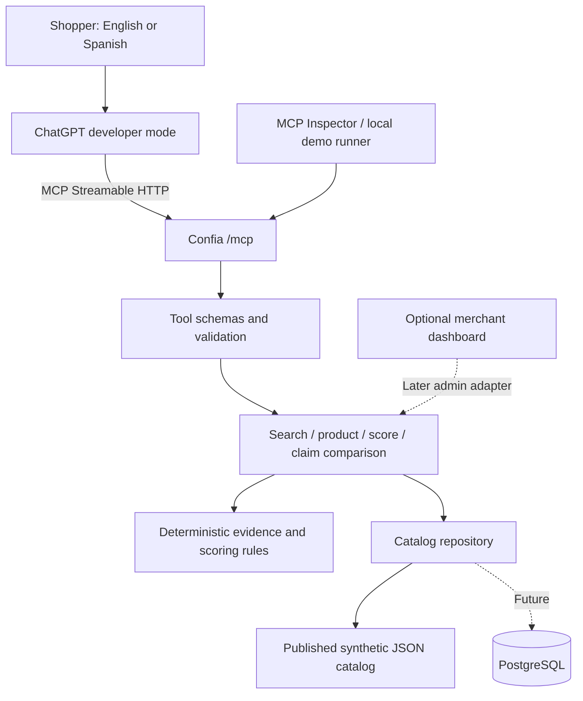
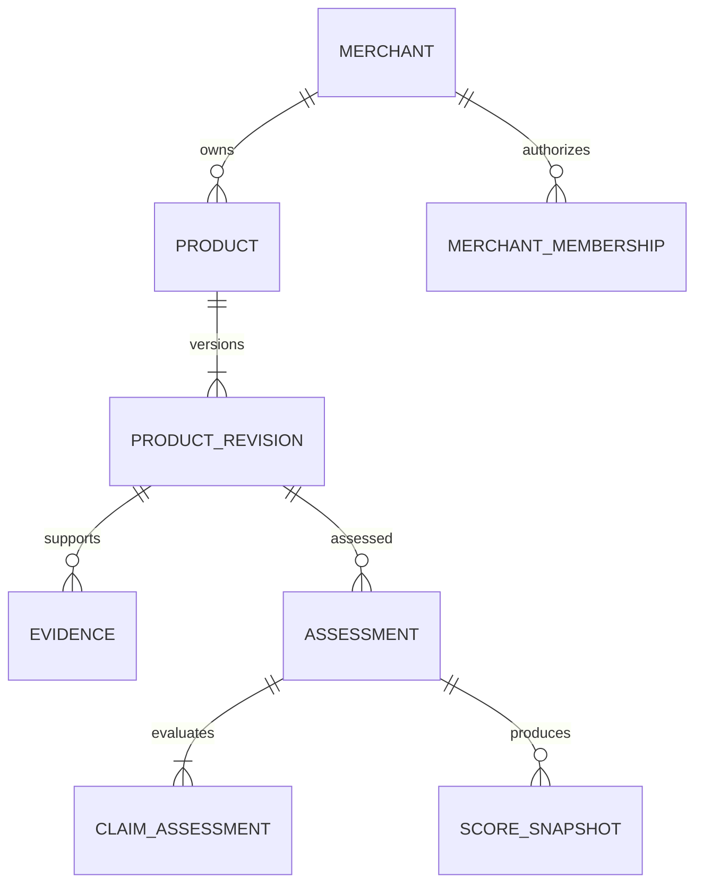

# ChatGPT-first architecture

Status: implementation blueprint. The repository currently contains documentation and environment templates, not a runnable server. The README defines the product direction; this document defines its technical boundaries. The archived PRODUCT_VISION.md contains earlier concepts.

## Primary decision

**ChatGPT developer mode is the shopper interface. Confĩa is a Node.js/TypeScript MCP backend.** There is no shopper website, custom chatbot, backend LLM orchestration, or embedded ChatGPT widget in the MVP. A merchant dashboard remains an optional later milestone.



The backend returns facts and evidence; ChatGPT selects tools, interprets the shopper's request, and writes the conversational answer. No OPENAI_API_KEY or model setting is required because this backend does not call the OpenAI API. ChatGPT account access and developer-mode availability must be confirmed separately on the account used for the demonstration.

OpenAI documents MCP servers without custom UI and Streamable HTTP endpoints. This project chooses that backend-only design. [Official MCP server guidance](https://developers.openai.com/plugins/build/mcp-server)

## Runtime and transport

Use one Node.js process with the TypeScript MCP SDK, a validated configuration module, and a repository selected at startup. Lock compatible versions during scaffolding; do not introduce Next.js to host the primary MCP server.

- `/mcp`: SDK-managed Streamable HTTP endpoint. Let the SDK handle initialization, protocol negotiation, tool discovery, calls, and method semantics. It is not a REST endpoint for arbitrary tool JSON.
- `/health`: lightweight HTTP liveness, with no credentials or catalog contents.
- `/ready`: readiness fails if required catalog/configuration cannot load. It does not test a ChatGPT login.
- Use a stateless transport configuration for the read-only prototype; do not require sticky sessions or store conversation history.
- Keep connections and cancellation scoped to the request. Bound tool duration and input/output size. Transport disposal must not close unrelated requests.
- No shopper REST API is required. A future admin HTTP adapter calls the same services directly; MCP must not loop through HTTP routes inside its own process.

For the demo, use a reachable HTTPS `/mcp` endpoint via a deployment or development tunnel. Secure MCP Tunnel is another supported developer-mode option; ordinary localhost is only directly accessible to local clients such as Inspector. Choose one connection method and rehearse it. [Official connection guidance](https://developers.openai.com/plugins/deploy/connect-chatgpt)

## Proposed project layout

These implementation files do not exist yet:

```text
src/
├── server.ts                       # HTTP lifecycle and /health /ready /mcp
├── config/env.ts                   # Explicit .env.local loading and validation
├── mcp/
│   ├── server.ts                   # SDK server factory and capabilities
│   ├── tools.ts                    # Register exactly four public tools
│   ├── schemas.ts                  # Shared runtime input/output schemas
│   └── results.ts                  # Text + structuredContent + safe errors
├── domain/
│   ├── products.ts
│   ├── evidence.ts
│   ├── trust-score.ts
│   └── discrepancy.ts
├── services/
│   ├── search-products.ts
│   ├── get-product.ts
│   ├── get-trust-score.ts
│   └── verify-product-claim.ts
├── repositories/
│   ├── catalog-repository.ts
│   └── json-catalog-repository.ts
└── i18n/                           # Localized catalog text and reason labels
scripts/
├── validate-catalog.ts
└── demo.ts                         # Local fallback using shared services
 data/demo-products.json
 tests/
├── domain/
├── services/
├── mcp/
└── fixtures/
```

A later merchant UI may live in `apps/merchant/` with its own dependencies. Extract shared domain modules into a package only when a second executable needs them. Avoid empty application folders that imply implementation exists.

## Module ownership

`ChatGPT → MCP adapter → application services → domain + repository interface`

| Boundary | Responsibility |
| --- | --- |
| ChatGPT | Conversation, query-to-tool arguments, bilingual explanation |
| MCP adapter | Tool metadata, runtime validation, transport result/error envelopes |
| Discovery | Deterministic localized text matching, explicit budget/currency/trust filters |
| Product service | Published revision and public evidence DTOs |
| Scoring | Versioned formulas, expiry, conflicts, null assessments |
| Comparison | Read-only comparison of supplied claims to eligible observations |
| Repository | Canonical catalog reads; no chat sessions or prompt storage |
| Admin workflow, later | Merchant submissions and independent assessment publication |

Expose exactly `search_products`, `get_product`, `get_trust_score`, and `verify_product_claim`. Comparison does not create or update verification. No submission, scoring override, or admin tools are exposed to ChatGPT.

## Shopper request flow

1. The shopper selects the Confĩa connection in ChatGPT and asks a shopping question.
2. ChatGPT supplies explicit schema fields, such as `maxPriceMinor: 20000`, `currency: "USD"`, and `locale: "es"`.
3. Confĩa validates those fields and searches localized catalog terms. It never asks another model to reinterpret the request.
4. Evaluate candidate assessments using one injected clock value; apply filters and stable relevance/ID ordering.
5. Return structured results, applied filters, public evidence references, synthetic labels, state, and timestamps.
6. ChatGPT explains those results. Follow-up questions can call the score or comparison tool using returned product IDs.

The server cannot guarantee ChatGPT's exact prose or tool selection. Rehearsal must inspect both the tool trace and final answer. Tool descriptions should request evidence-grounded answers, retention of conflict/unknown states, and preservation of amounts/currencies; these descriptions are guidance, not security controls.

Explicit filters are authoritative. Queries without a currency should not silently interpret a dollar sign as a specific currency. An empty result is a valid success; do not invent products. Optional follow-up calls should use returned revision IDs to avoid mixing facts from different revisions.

## Data and merchant flow

For the MVP, developers prepare 8–12 labeled synthetic products and pre-assessed evidence in a validated, read-only fixture. Include complete, partial, stale, conflicting, and unassessed examples. Publication means reviewing the fixture and releasing a new catalog revision; MCP never edits it.

Initial merchant demonstrations may use a local script or later dashboard with an isolated in-memory draft store. Draft submission is pending and has no score. Public MCP sees only published assessments; it cannot read drafts. No public merchant write routes are part of the MVP. A later durable implementation requires authenticated membership, row-level ownership policies, idempotency, a trusted assessor, and atomic publication.

Demo clocks: tests inject CONFIA_TEST_NOW, but a deployed server uses real UTC time. Prepare a new, explicitly synthetic assessment fixture before rehearsal to demonstrate current evidence; never silently reset observation timestamps at startup. Preserve a deliberately stale example.

## Domain model

Use UUIDs for durable identifiers, integer minor units for money, ISO currency codes, explicit units for numerical specifications, and UTC timestamps. Demo IDs may be readable strings. A product revision is immutable once assessed.

| Entity | Key fields and constraints |
| --- | --- |
| Merchant | `id`, display name; identity membership is separate |
| MerchantMembership | `userId`, `merchantId`, role; unique pair |
| Product | `id`, `merchantId`, `sku`, active revision; unique merchant/SKU |
| ProductRevision | `id`, `productId`, revision number, localized name/description, category, priceMinor, currency, availability, specifications, submittedAt, synthetic flag |
| Evidence | `id`, revisionId, claimKey, observed value/unit/currency, source URL/label, sourceKind, observedAt, collectedAt, expiresAt, content digest, visibility |
| Assessment | `id`, revisionId, methodologyVersion, assessedAt, assessor, status, required claim manifest |
| ClaimAssessment | assessmentId, claimKey, status, evidence IDs, reason; unique claim per assessment |
| ScoreSnapshot | assessmentId, evaluatedAt, score, component points, expiresAt; append-only |
| AuditEvent | actor, action, entityId, timestamp, requestId; no raw secrets |

Claim statuses are `verified`, `conflicting`, `missing`, and `unsupported`. Runtime eligibility can additionally report `stale`. Product availability is `InStock`, `OutOfStock`, or `Unknown`.

A merchant submits facts; an assessor evaluates evidence. A source marked `merchant` must stay labeled as merchant-provided. Source provenance is not proof of independence. Synthetic assessments must always identify themselves as demo results.

Required specifications and supporting claims come from a versioned category policy, frozen into the assessment. Merchants cannot increase their score by removing a failing claim from the denominator. For the power-tool demo, the supporting manifest includes warranty and return-policy evidence; reviews are deferred until an assessment method exists.



PostgreSQL foreign keys enforce these relationships. Index products by merchant/SKU, revisions by product/version, evidence by revision/claim, and assessments by revision/time. Publish a revision and completed assessment atomically. Retain historical records; corrections create new revisions or assessments.


## Scoring policy v1


This is a proposed prototype policy, not an empirically validated certification methodology. Use an injected UTC clock. Reject negative money, invalid dates, future observation dates, unknown policy versions, and verified counts greater than required counts.

An eligible claim has a completed `verified` decision, evidence attached to the same revision, and at least one accepted source observation satisfying `observedAt <= now < expiresAt`. An unresolved contradiction makes the claim ineligible even if another observation supports it. Missing or unsupported claims earn no points.

Maximum age is 24 hours for price/availability and 30 days for specifications/supporting policy evidence. Set expiry to the earlier of source expiry and observation time plus that maximum. These windows are versioned prototype choices. Exactly at expiry the evidence is stale. Assessment timestamps do not reset observation freshness.

Let `P` and `A` be 1 for eligible price and availability, otherwise 0. Let `S` be eligible required specifications divided by required specifications; let `E` be eligible required supporting claims divided by required supporting claims. A zero denominator contributes 0, never NaN or full credit.

Let `F` be the fraction of all required claims (price, availability, required specifications, supporting claims) that have an accepted, unexpired observation, even if the claim decision is conflicting. Freshness describes recency, while the other components describe agreement and coverage. Missing observations count as 0.

```text
pricePoints         = 20 * P
availabilityPoints  = 20 * A
specificationPoints = 25 * S
freshnessPoints     = 20 * F
supportPoints       = 15 * E
trustScore          = round((sum of component points) / 10, 1)
```

Do not round intermediate components. Example: price and availability eligible, four of five specifications eligible, both supporting claims eligible, and all nine required claims have fresh accepted observations. Points are `20 + 20 + 20 + 20 + 15 = 95`; score is **9.5**. The fifth specification can be conflicting, explaining why freshness is complete while verification coverage is partial.

No completed assessment means `trustScore: null` with state `unverified`. A completed assessment with no eligible evidence may legitimately score 0.0. Proposed display states:

- `verified`: all required claims eligible.
- `partial`: some required claims ineligible, with no unresolved conflict or expired required observations.
- `conflicting`: at least one required claim has an unresolved contradiction; takes precedence over stale.
- `stale`: at least one required accepted observation expired and no conflict takes precedence.
- `unverified`: no completed assessment for the active revision.

A high score does not override a conflict label. Show reasons in addition to the summary state. Current scores are evaluated on reads; historical snapshots retain their original evaluation time. Return the next future evidence expiry as `validUntil`, or null if no future expiry exists. Disable shared response caching in the initial implementation; later cache only until the earliest expiry and invalidate on revision/assessment changes.


## Bilingual output and evidence

Use the same canonical IDs, facts, scores, and evidence for both locales. Return translated labels and descriptions where available; expose an explicit fallbackLocale when missing. ChatGPT handles conversational translation, while tool outputs retain exact money, units, timestamps, and status codes. Never translate a currency into a different monetary amount.

Return public evidence summaries with source labels, observation/expiry times, provenance, and source URLs where actually available. Synthetic evidence should use a clearly labeled demo source with a null URL rather than a fabricated citation. Product IDs and evidence IDs are internal references, not clickable sources. No product website is needed to return useful evidence.

## Authentication and security

The initial no-auth endpoint is permitted only for a public, synthetic, read-only demo. Set CONFIA_DATA_SOURCE=demo and CONFIA_MCP_AUTH_MODE=none; reject startup if this combination could expose private or durable merchant data. No-auth means anyone who reaches the endpoint can read its demo catalog.

Private data requires a separate implementation milestone for MCP-compatible user authorization (OAuth), token validation, and authorization per tool. An environment switch alone must never claim to enable authentication. Do not use an arbitrary shared bearer token as a substitute for a supported ChatGPT authentication flow.

Validate host/origin handling for the selected transport and deployment. Keep CORS restrictive where applicable; it is not authentication. Rate-limit public calls and enforce configured payload bounds. Treat every tool argument and evidence string as untrusted; evidence content cannot supply instructions, URLs to fetch, or authorization. Tool annotations describe behavior but do not enforce permissions.

Read-only demo tools access a bounded fixture and never fetch user-provided URLs. A later fetcher needs separate SSRF and egress controls. Secrets, merchant drafts, raw private evidence, and stack traces must not enter results or logs.

## Deployment and operations

Deploy one Node.js MCP service with a validated catalog bundled into the release. A container or persistent Node host is the baseline; use serverless hosting only after verifying the SDK transport, streaming/proxy behavior, cancellation, and execution limits. Vercel is not assumed merely because the old design used Next.js.

Keep the configured public origin aligned with the actual tunnel/deployment URL. TLS terminates at the host or tunnel. Reject non-HTTPS public origins outside local development. Log request ID, tool name, duration, outcome, catalog revision, and methodology version; omit full conversations and arguments by default. Readiness checks loadable fixtures and valid configuration. Record releases so code and fixture revisions can be rolled back together.

Current scoring evaluates expiry on each call. Later caching must stop at the earliest evidence expiry and invalidate on catalog publication. A future refresh worker appends new assessments rather than rewriting historical ones.

## Delivery and acceptance gates

1. Scaffold TypeScript/Node, pin the SDK and runtime, commit a lockfile, and implement environment validation.
2. Validate fixtures and deterministic scoring/comparison tests, including expiry boundaries and conflicts.
3. Register all four MCP tools and test initialization, discovery, schemas, results, errors, and cancellation locally.
4. Connect the reachable endpoint in ChatGPT developer mode and rehearse English and Spanish requests.
5. Check that final answers preserve scores, conflicting/unknown states, synthetic labels, money, and timestamps. Save sanitized evaluation notes.
6. Add the local demo runner as fallback using the same services. A tiny later backup panel may use an admin adapter; no second shopper application is required.
7. Only after the core ChatGPT demo works, consider the merchant dashboard, persistent database, authorization, and recurring verification.

See [MCP contracts](API.md) and the [ChatGPT setup and rehearsal guide](CHATGPT_SETUP.md). Scoring policy is unchanged by the interface migration.
